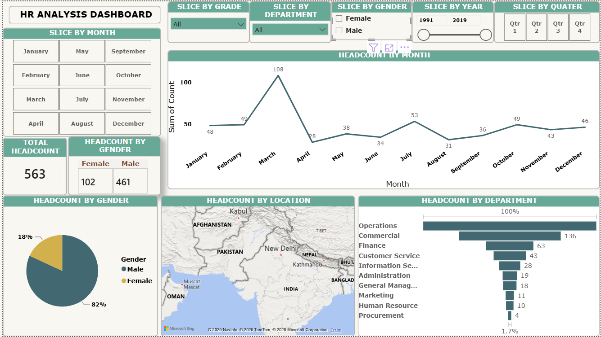
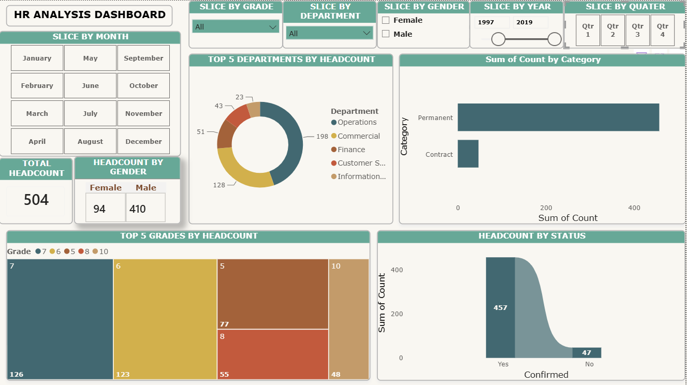

# HR Analytics Dashboard

## 📌 Project Overview

This project is an interactive HR Analytics Dashboard developed using Microsoft Power BI. It provides workforce insights through dynamic dashboards, helping analyze employee headcount, department distribution, gender diversity, grade analysis, employment status, and workforce trends.

---

## 🛠 Tools & Technologies

- Microsoft Power BI
- Power Query
- DAX
- Microsoft Excel

---

## 📊 Key Performance Indicators (KPIs)

- Total Headcount
- Male vs Female Headcount
- Monthly Headcount Trend
- Department-wise Headcount
- Location-wise Headcount
- Top 5 Departments by Headcount
- Top 5 Grades by Headcount
- Employee Category (Permanent vs Contract)
- Employee Confirmation Status

---

## 📈 Dashboard Visualizations

### Page 1
- Monthly Headcount Trend (Line Chart)
- Gender Distribution (Pie Chart)
- Department-wise Headcount (Bar Chart)
- Location-wise Headcount (Map)
- Total Headcount KPI Cards
- Male & Female Headcount Cards

### Page 2
- Top 5 Departments by Headcount (Donut Chart)
- Top 5 Grades by Headcount (Treemap)
- Employee Category Analysis (Bar Chart)
- Employee Confirmation Status (Ribbon Chart)
- Total Headcount KPI Cards

---

## 🎛 Interactive Filters

Users can analyze HR data using interactive slicers:

- Month
- Grade
- Department
- Gender
- Year
- Quarter

---

## 💼 Business Insights

This dashboard enables HR teams to:

- Monitor workforce headcount
- Analyze department-wise employee distribution
- Compare male and female workforce
- Track monthly hiring trends
- Identify top-performing departments
- Evaluate employee grades
- Monitor employment categories
- Analyze employee confirmation status

---

## 📂 Repository Files

- HR-Analytics-Dashboard.pbix
- HR-Dataset.xlsx
- Dashboard-Page1.png
- Dashboard-Page2.png

---

## 📷 Dashboard Preview

### Dashboard - Page 1

### Dashboard - Page 2

---

## 👩‍💻 Author

**Bisma Iftikhar**

Aspiring Data Analyst | Microsoft Excel | Microsoft Power BI | Power Query | DAX | Dashboard Development
